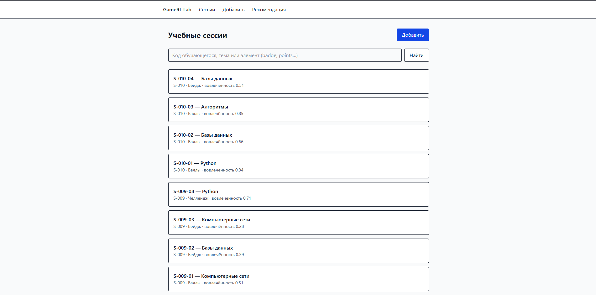
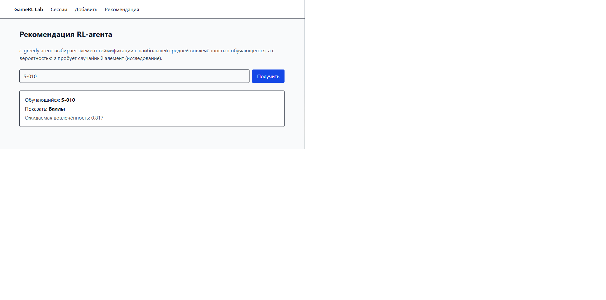
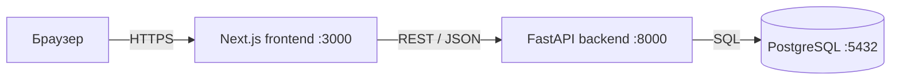

# GameRL Lab — адаптивная геймификация на основе обучения с подкреплением


Веб-приложение для журнала учебных сессий: какой элемент геймификации (баллы, бейдж, рейтинг,
прогресс-бар, челлендж) получил обучающийся и как изменилась его вовлечённость.
RL-агент (ε-greedy бандит) рекомендует каждому обучающемуся элемент, повышающий его вовлечённость.

## Связь с диссертацией
Тема: «Модели и методы адаптивной геймификации образовательной платформы на основе обучения
с подкреплением для управления вовлечённостью обучающихся».

Приложение — прототип контура управления: данные о взаимодействии → оценка вовлечённости →
выбор элемента геймификации агентом. ε-greedy бандит служит базовой моделью (baseline),
которая в диссертации заменяется основными RL-моделями.

Публикации: <добавьте ссылки с DOI>

## Скриншоты



## Архитектура


| Компонент | Технология |
|---|---|
| Фронтенд | Next.js 16, TypeScript, Tailwind CSS |
| Бэкенд | Python 3.12, FastAPI, Pydantic |
| Доступ к БД | SQLAlchemy 2, Alembic |
| База данных | PostgreSQL 17 (образ pgvector) |
| Инфраструктура | Docker, Docker Compose |
| CI | GitHub Actions, Dependabot, CodeQL |

Подробнее: [docs/architecture.md](docs/architecture.md)

## Быстрый старт
```bash
cp .env.example .env
docker compose up --build
docker compose exec backend python -m scripts.seed
```
- Сайт: http://localhost:3000
- Документация API: http://localhost:8000/docs

### Запуск в GitHub Codespaces
В Codespaces сеть bridge между контейнерами не работает, поэтому используется дополнение
`docker-compose.codespaces.yml` (сеть хоста). Перед запуском добавьте строку в `.env`:
```bash
echo "COMPOSE_FILE=docker-compose.yml:docker-compose.codespaces.yml" >> .env
docker compose up --build
```
Порты 3000 и 8000 открываются во вкладке «Порты».

## Локальная разработка без Docker
```bash
docker compose up -d db
cd backend && uv sync && uv run alembic upgrade head && uv run uvicorn app.main:app --reload
cd frontend && npm install && npm run dev
```

## Тесты и проверки
```bash
cd backend && uv run pytest -q && uv run ruff check .
cd frontend && npm run lint && npm run build
```

## Структура проекта
- `backend/app/modules/sessions` — модель, схемы, сервис, эндпоинты и RL-рекомендация
- `backend/alembic` — миграции БД
- `backend/tests` — тесты API (9 тестов, включая ошибки 404, 409, 422)
- `backend/scripts/seed.py` — генерация синтетических данных
- `frontend/src/app` — страницы Next.js
- `docs/` — архитектура и скриншоты

## Данные
Синтетические данные: 40 сессий 10 условных обучающихся (`S-001`…`S-010`), генерируются
`backend/scripts/seed.py`. У каждого обучающегося задан скрытый «предпочтительный» элемент
геймификации, который RL-агент должен выявить. Персональные данные не используются.

## AI assistance
Для генерации шаблонов кода, конфигураций и пошаговых инструкций использовался
ИИ-ассистент Claude (Anthropic). Весь код запущен, проверен и протестирован автором.

## Лицензия и контакты
MIT. Автор: Жүсіп Т.Н., zhussip_tn_@enu.kz.