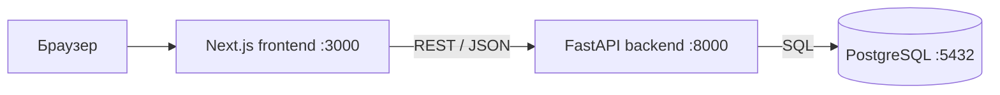
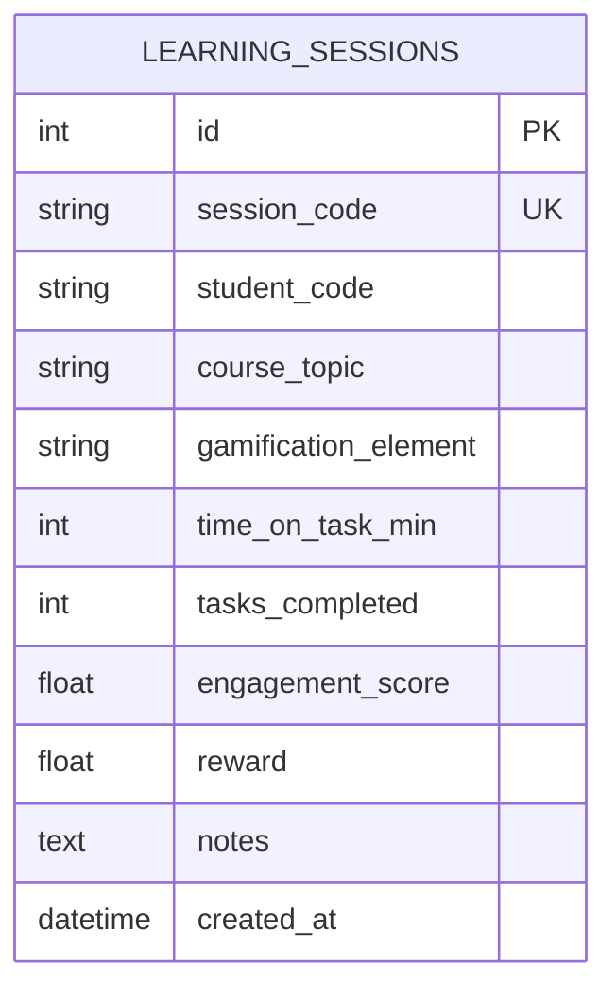

# Архитектура GameRL Lab

## Компоненты

Next.js получает данные в серверных компонентах и отправляет формы через Server Actions;
браузер не обращается к API напрямую.

## Схема базы данных

## Эндпоинты API
| Метод | Путь | Описание | Коды ответов |
|---|---|---|---|
| GET | /health | проверка работы | 200 |
| GET | /sessions | список; поиск `q`, пагинация `limit`/`offset` | 200, 422 |
| GET | /sessions/recommend | рекомендация RL-агента (`student_code`, `epsilon`) | 200, 422 |
| GET | /sessions/{id} | одна сессия | 200, 404 |
| POST | /sessions | создать сессию | 201, 409, 422 |
| PATCH | /sessions/{id} | изменить сессию | 200, 404, 409, 422 |
| DELETE | /sessions/{id} | удалить сессию | 204, 404 |

## RL-агент (baseline)
ε-greedy многорукий бандит: «руки» — пять элементов геймификации, награда — вовлечённость.
С вероятностью 1−ε выбирается элемент с наибольшей средней вовлечённостью обучающегося
(эксплуатация), с вероятностью ε — случайный (исследование). Для нового обучающегося без
истории используется средняя по всем (решение проблемы холодного старта).

## Ключевые решения
1. **Модульный монолит.** Один бэкенд и одна БД, код разделён на модули. Для проекта такого
   масштаба проще микросервисов.
2. **FastAPI, а не Django.** Автоматическая документация /docs, проверка данных через Pydantic,
   лёгкий REST API без лишних компонентов.
3. **Слои models / schemas / service / router.** Бизнес-логика отделена от HTTP и SQL, её проще
   тестировать и заменять (например, заменить агента).
4. **Миграции Alembic.** Схема БД версионируется вместе с кодом; изменения воспроизводимы.
5. **ε-greedy как baseline.** Простой, интерпретируемый алгоритм для сравнения с основными
   RL-моделями диссертации.
6. **Отдельный compose-файл для Codespaces.** В GitHub Codespaces сеть bridge между
   контейнерами не работает, поэтому `docker-compose.codespaces.yml` переводит сервисы
   в сеть хоста; основной `docker-compose.yml` остаётся стандартным.